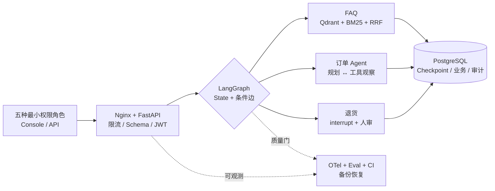

# ServiceOps Agent

一个面向企业售后工单场景的 AI Agent 求职项目。项目不会把所有业务都交给大模型，
而是用 LangGraph 将模型决策、确定性业务规则、工具调用和人工审批组织成可测试的状态图。

## 架构总览



完整的五层系统总览、退货审批时序和 Docker 双实例拓扑见
[`docs/architecture.md`](docs/architecture.md)；90 秒面试画法见
[`docs/architecture/interview-whiteboard.md`](docs/architecture/interview-whiteboard.md)。

## 当前进度：第 30 步——GitHub发布验收与公开安全

项目默认使用确定性关键词分类器，保证没有模型密钥也能运行；同时已经提供可切换的
OpenAI 兼容模型通道，用 Pydantic 约束模型只能返回意图、置信度和简短原因。
模型认证失败、限流、超时、网络异常或结构化输出失败时，会生成脱敏故障状态并进入人工
接管路径，不再让外部模型异常直接击穿 FastAPI。
FAQ 已接入受治理知识源、稳定切片、可替换 Embedding、独立 Qdrant、全语料 BM25、RRF 融合、证据阈值和 Citation；
只有检索到已发布公共证据才会回答，无证据、低分或检索故障会安全转人工。
在此基础上，回答层支持确定性摘录和真实千问结构化生成两种模式；模型只能从本次候选切片中
选择引用，伪造引用、空引用、主动拒答或生成服务异常都会被第三道条件边拦截。项目还加入了
版本控制的正负例评测集，可持续计算 Recall@K、MRR@K、检索决策准确率和负例误召回率。
订单路径已经从单节点固定调用升级为显式的“规划 → 工具 → 观察 → 再规划”循环，支持一次查询
多个订单，并由服务端强制执行工具白名单、身份绑定、最大步数、重复调用检测、参数/结果校验和
明确停止条件。规划器可在确定性基线和真实千问结构化规划之间切换。
退货申请路径加入了真正的 LangGraph `interrupt`、Checkpointer 和 `Command.resume`：图先生成
经过归属/资格预检查的强类型草案，审批前零写入，只有明确批准才能执行身份绑定的写 Tool。
拒绝路径不会触达工具；幂等键可保证相同业务请求跨线程重试仍只产生一条申请。
FastAPI 运行时现在支持 `memory`、`sqlite`、`postgres` 三种持久化模式。SQLite 继续用于零额外
服务的单机学习；Docker Compose 默认使用官方 `AsyncPostgresSaver` 保存 LangGraph Checkpoint，
并用 PostgreSQL 业务表保存退货、Outbox 与审批审计。Saver、图、连接池和仓库由 lifespan 统一
管理；API 容器销毁并重建后仍能按原 `thread_id` 读取终态和审计链。事务、唯一键、行锁和按业务键
划分的事务级建议锁，保证多个应用实例并发处理相同幂等键或审计线程时不会产生重复记录或链分叉。
API 入口现在要求签名 JWT：`sub` 是唯一可信用户/审批人身份，普通用户 Token 只有
`agent:chat`，退货审批 Token 只有 `return:approve`。请求体已经删除并禁止额外传入
`user_id/reviewer_id`；签名、固定算法、issuer、audience、过期时间、必要 Claims 和角色—权限
组合会在进入 LangGraph 前全部校验。
审批决定现在会在恢复图之前写入独立审计仓库，执行后再追加成功、拒绝或失败事件。每个线程形成
带前驱引用的 SHA-256 哈希链；SQLite/PostgreSQL 都使用事务、唯一约束和拒绝普通更新/删除的触发器，读取时
重新计算完整链。新增独立 `auditor` 角色与 `audit:read` Scope，customer/reviewer 都不能查看
审计证据。审计表只记录可信主体、Token `jti`、业务摘要和结果编号，不复制完整 Token、原因、
幂等键或审批备注原文。
当前又加入 OpenTelemetry Trace/Metrics、HTTP/FastAPI/HTTPX instrumentation、全部 LangGraph 节点
Span、低基数业务指标以及关联 `trace_id/span_id` 的安全 JSON 日志。`/health` 保持轻量存活检查，
`/ready` 会真实读取 Checkpointer、退货业务库、事务 Outbox 和审计库；依赖异常时返回脱敏 503。用户原文、Token、
API Key、订单号和请求 ID 均不会成为 Metrics 标签。
退货业务提交与 `workflow_completed` 审计事件之间的双写窗口现已由 Transactional Outbox 消除：
SQLite/PostgreSQL 在同一事务内写入退货记录和最小化 Outbox 事件，协调器再以至少一次语义投递到幂等审计仓库。
进程在审计写入前或写入后退出都能在重启后安全补偿。事件支持退避、三次失败转死信，并新增独立
`operator` 角色、`operations:reconcile` Scope 和低敏运维补偿接口。
现在又加入受版本控制的端到端 Agent 黄金数据集。标准离线配置会真实运行完整 LangGraph，分别计算
意图路由、工具轨迹、响应契约、安全不变量和整体通过率，并记录不作为默认跨机器硬门槛的 P95 耗时。
13 条首版样本覆盖 FAQ 引用、单/多订单工具循环、缺参澄清、未知意图降级、提示注入不能改身份、
跨用户信息隐藏和退货审批前零写入。质量门失败时示例返回非零退出码，可直接接入 CI。
现在标准质量门已经接入 GitHub Actions：Push/PR 只运行无密钥、零模型费用的 Ruff、Mypy、Pytest 和
完整 Agent 离线评测，逐样本 JSON 报告作为 Artifact 留存。外部 Action 使用完整提交 SHA，工作流
`GITHUB_TOKEN` 只有 `contents: read`。
真实千问使用独立手工工作流和付费确认开关，不会在普通提交中自动调用。实验先跑一次严格确定性
基线，再默认重复三轮千问候选，聚合平均通过率、最差轮、全轮稳定样本率和安全不变量准确率。
当前候选只替换分类、订单规划和有据回答，检索继续使用 Hash Embedding，从而控制主要实验变量。
首次 `qwen-plus` 单轮实验 `1.0.0` 原始得到 9/13；复盘确认三条失败来自 LLM/确定性分类事件命名不一致，
只有一条是内部补偿政策的真实路由误差，且 RAG 权限层仍安全转人工、没有内部文档泄漏。项目现已统一
后端无关业务事件、在报告中保存有限 `actual_events`，并明确要求非公开内部政策转人工。由于提示和
评测契约已经变化，候选实验升为 `1.1.0`。真实 `qwen-plus` 已连续复测三轮，每轮均为 13/13，平均通过率、
最差轮通过率、全轮稳定样本率和平均安全不变量准确率均为 100%。这些结果只代表当前 13 条版本化小型
黄金集，不外推为线上全量准确率。
现在又加入固定 Python 补丁版本/镜像摘要与固定 uv 的多阶段 Docker 构建。builder 根据 `uv.lock` 安装
生产依赖并以非 editable 方式安装项目，runtime 只保留 `.venv` 和只读种子数据；本机 `.env`、虚拟
环境、SQLite/WAL 和测试材料不会进入构建上下文。
最终 API 容器以固定 `10001:10001` 非 root 身份和单 Uvicorn worker 运行；Compose 默认只绑定本机回环
地址，根文件系统只读，删除全部 Linux Capability并禁止提权。PostgreSQL 作为独立容器运行，5432
不映射到 Windows；只有数据库目录进入具名卷，API 容器本身无状态。
镜像和 Compose 都使用真实 `/ready` 探针，只有 Checkpointer、业务库、Outbox 和审计库全部可读才接流量。
新增独立无密钥镜像 CI，会在 Linux 上真实 build/run，并验证非 root、四依赖 ready 与未认证 chat=401。
真实演练已经完成“写入批准退货 → 修复一次 PostgreSQL 参数类型问题 → Outbox 补偿 → 强制重建 API
容器 → 恢复原 LangGraph 终态和有效审计哈希链”。业务表结构现由 Alembic 版本脚本管理；Compose
使用一次性 `migrate` 任务先升级数据库，再启动两个无状态 API。Nginx 是 Windows 唯一入口，默认
轮询 `agent-a/agent-b`，两个实例返回低敏实例响应头并共享 PostgreSQL。第十七步自动演练已经证明：
A 创建的等待审批线程可在 A 停止后由 B 恢复并完成，审计链保持有效；两个独立连接池同时提交相同
幂等键时恰好一边创建、另一边安全重放。该本机拓扑用于展示多实例关键原理，不冒充云生产平台；
真实上线仍需要平台密钥、TLS、备份恢复、数据库高可用、容量压测与正式发布审批。
第十八步又增加两层过载保护：Nginx 对 `/api/` 按来源地址采用 5r/s、burst 10 和最多 20 个并发连接，
超过时返回带 `Retry-After` 的 JSON 429；每只 Agent 使用 8 个进程内业务工位，短排队超时后返回脱敏
503。`/health`、`/ready` 和 Swagger 不占业务工位。真实本机离线基线中，正常 12/12 成功且 A/B 各
处理 6 条；40 条瞬时请求 11 条成功、29 条被 429 削峰、无异常 5xx，三秒后恢复 200 且 readiness 4/4。
这些数字只描述当前电脑的离线确定性后端，不冒充真实模型生产 SLA。
第十九步又补上数据库灾难恢复的最小可信闭环：运维组件通过容器内 PostgreSQL 18.4 工具生成 custom
格式逻辑备份，采用 partial 文件与原子改名防止半成品冒充可用备份，并生成 SHA-256、工具版本、文件
大小和逐表有限指纹清单。每次演练只创建代码内部生成的随机临时数据库，在单事务中恢复后比较全部
公共表的表集合、行数和内容指纹，最后删除临时库；真实 `serviceops` 库无法成为恢复或删除目标。
本机首次实测归档 160047 bytes，包含 36 个归档对象，8 张公共表全部一致且无临时库残留。该能力证明
逻辑备份可恢复，不等同于生产高可用、异地备份或任意时间点恢复。
第二十步增加随 Python wheel 和 Docker 镜像发布的本地 Agent 控制台。访问服务根路径会进入
`/console/`：左侧展示 PostgreSQL、Checkpointer、Outbox 和审计库 readiness，中间通过真实
`/api/v1/chat` 展示售后对话、RAG 引用与退货 interrupt，右侧把后端公开 `events` 转换为 LangGraph
执行时间线，并支持使用独立审批人 Token 恢复线程、使用独立审计员 Token 验证哈希链。页面不会展示
模型隐藏思维链，也没有免登录演示后门；四类控制台短期 Token 只保存在当前网页内存，刷新后自动清空。
HTML 使用同源 CSS/JavaScript 和严格 CSP，禁止内联脚本、第三方外连与 iframe 嵌入。
第 20.1 步在控制台中加入可单步回放的教学调试器。独立 `developer` 角色凭 `debug:read` 读取
LangGraph 官方 `aget_state_history`，页面可以查看刚执行的节点、下一节点、相邻 State 字段差异、
工具/RAG、interrupt 与 checkpoint_id。后端只返回字段白名单并递归删除身份、Token jti、幂等键、
审批主体和工具指纹；接口固定声明不展示隐藏推理原文，production 环境直接关闭。Checkpoint
反序列化也采用显式领域类型白名单，不开启 pickle 回退。
第 20.2 步重新设计了教学界面：Checkpoint 调试器不再挤在右侧窄栏，而是位于对话区下方并占满
主内容宽度。流程解释和状态检查器采用左右分区，状态卡支持双列阅读；“专注大屏”会临时隐藏侧栏、
对话和指标，只保留回放工作台，并支持左右方向键单步切换、`Esc` 退出。该模式只改变浏览器排版，
不会重新执行 Agent、修改 Checkpoint 或扩大 developer 权限。
第 21 步把已经完成的工程能力整理成可重复面试演示。`examples/21_interview_demo.py` 会按固定顺序
校验 Compose、构建并等待本地拓扑、执行真实订单与 Checkpoint 冒烟、打印本次短期角色 Token，并打开
本地控制台；报告不保存 Token，默认 Docker 配置不调用千问。项目同时提供五分钟演示 Runbook、常见
故障排查表、短课和一页式速查卡，确保页面动作、技术解释和可验证证据彼此对应。
第 22 步把原有庞杂且存在历史残留的架构说明重构为三张权威图：系统总览图用五层解释职责，退货
时序图解释 interrupt、审批、恢复、事务 Outbox 与审计，Docker 拓扑图解释 Nginx、双 Agent、迁移任务、
PostgreSQL 和具名卷。README 使用更小的求职展示版；另有 90 秒白板画法、第15课和可打印速查图。
第 23 步调研了 2026 年 8 月杭州应届、实习与资深 Agent 岗位，把 Python/FastAPI、LangGraph 工具流、
RAG、评测和 Docker 等高频要求映射到项目真实证据；新增一页式中文简历内容初稿、个人信息补充表、
逐条代码证据地图和虚假生产经历防回归测试。当前简历仍保留个人信息占位符，补齐真实资料后才导出 PDF。
第 24 步不再用 4 个短 Chunk 和 11 条简单题证明 RAG 满分，而是先建立 14 份相邻政策、23 个真实 Chunk、
32 条开发样本和 12 条锁定样本的困难实验。旧 Hash 方案在开发集上 Recall@5 为 100%，但 Top-1 仅 87.5%、
负例误召回率为 100%，由此把后续工作明确拆成拒答边界、语义召回和候选排序三类问题；本阶段锁定集未运行、
不调用付费 API，也还没有把 BM25、RRF 或 Rerank 冒充为已实现能力。
第 25 步先扫描 0.10–0.35 的向量阈值，证明仅靠提高门槛虽然能把负例误召回降到 0%，却会让正例
Recall@5 从 100% 跌到 20.8%。因此在 Embedding 前加入高置信业务范围门，开发集 Decision 从 75% 提高到
100%、负例误召回率从 100% 降到 0%，正例 Recall 保持 100%；冻结候选在 12 条 holdout 上同样取得
Recall 100%、Decision 100%、FPR 0%，但 Top-1 只有 75%，排序仍是下一项独立问题。
第 26 步针对相邻政策误排新建 20 条排序开发集和 10 条排序 holdout，在固定向量 Top-5 内比较四组 BM25
融合权重。冻结的 25% 词面候选让开发集 Top-1 从 80% 提高到 95%、MRR 从 90% 提高到 97.5%；新 holdout
Top-1 从 90% 提高到 100%、MRR 从 95% 提高到 100%，Recall 保持 100% 且候选集合变化为 0。它是本地
可解释候选重排，不冒充 Cross-Encoder、LLM Rerank 或完整 BM25 混合召回。

当前已经包含：

- LangGraph `StateGraph`、共享状态、节点和条件边；
- `Annotated[list[str], operator.add]` Reducer，用于累积执行轨迹；
- 显式 LangGraph 环、确定性/LLM 双规划器和 Pydantic `ToolCallPlan`；
- 工具白名单、最大步数、请求内调用指纹去重和工具异常安全降级；
- LangGraph `interrupt`、`Command.resume`、`thread_id` 和可恢复审批子图；
- `AsyncSqliteSaver`、FastAPI lifespan 和跨进程重启恢复；
- `AsyncPostgresSaver`、psycopg 连接池和 PostgreSQL 多实例共享 Checkpoint；
- Alembic 业务 Schema 版本链、一次性迁移任务和 API 启动期 DDL 分离；
- Nginx 统一入口、双 Agent 轮询、Docker DNS 重解析和低敏实例响应头；
- A 创建/B 恢复的自动故障切换演练与双连接池并发幂等测试；
- Nginx 5r/s + burst 10 请求削峰、每来源连接上限和固定 JSON 429；
- 每实例 8 个业务工位、短排队超时、脱敏 503 与低基数容量拒绝指标；
- 正常/突发/恢复三阶段容量脚本、P50/P95/P99 和双实例分布报告；
- 独立 Checkpoint/业务数据库、SQLite WAL/事务/唯一键并发幂等；
- PostgreSQL TIMESTAMPTZ/JSONB、事务级建议锁、行锁、唯一约束和只追加触发器；
- HTTP Bearer JWT、固定 HS256、iss/aud/exp/jti 必需 Claims 校验；
- customer/reviewer 角色、`agent:chat`/`return:approve` Scope 隔离；
- auditor 角色、`audit:read` Scope 和审批/审计职责分离；
- Token `sub` 注入可信身份，请求体身份字段 `extra=forbid`；
- 决定/结果双事件、每线程 SHA-256 前驱哈希链和读取时完整性重算；
- 内存/SQLite/PostgreSQL 审计仓库、事务追加、唯一约束和 UPDATE/DELETE 保护触发器；
- 审计数据最小化：只存 JWT `jti` 与业务摘要，不存 Token 和自由文本原文；
- OpenTelemetry FastAPI/HTTPX 自动 instrumentation 与 W3C Trace Context；
- Agent 根业务 Span、14 个 LangGraph 节点 Span 和审批/审计 Span；
- Agent/节点耗时、工具次数、人工接管和审批结果低基数指标；
- 自动关联 trace_id/span_id、CRLF 清理和 extra 白名单的 JSON 日志；
- `/health` liveness 与真实依赖 `/ready` readiness 分离；
- 退货业务记录与 Outbox 事件同一 SQLite 事务原子提交；
- 至少一次投递、审计消费者幂等、指数退避和 dead letter；
- operator 角色、`operations:reconcile` Scope 和受权补偿接口；
- 版本化端到端 Agent 数据集、人工参考输出和 Pydantic 标签一致性校验；
- 路由/工具轨迹/响应契约/安全不变量四维代码评估器；
- 整体通过率、四维准确率、P95 耗时和 CI 非零退出质量门；
- Push/PR 零费用 GitHub Actions，Ruff/Mypy/Pytest/Agent Eval 自动门禁；
- 最小 `GITHUB_TOKEN` 权限、第三方 Action 完整 SHA 固定和 JSON Artifact；
- 真实千问手工候选工作流、Secret 注入和显式付费确认保护；
- 基线先行、候选多轮、平均/最差/逐 case 稳定性和安全晋级门；
- 固定 Python 补丁版本/镜像摘要和 uv 版本的多阶段 Docker 构建；
- 基于 `uv.lock` 的生产依赖同步与非 editable wheel 安装语义；
- 非 root 固定 UID/GID、单 Uvicorn worker 和 SIGTERM 优雅关闭；
- `.dockerignore` 密钥/虚拟环境/SQLite 运行状态构建上下文隔离；
- Compose 回环端口、只读根目录、具名卷、零 Capability 与资源边界；
- 源码、wheel、容器三种安装布局的项目根目录发现策略；
- 容器 liveness/readiness/JWT 401 三层冒烟脚本；
- Push/PR 真实 Linux 镜像 build/run 与权限/探针自动门禁；
- Push/PR 一次性 PostgreSQL 服务与跨运行时、业务、JSONB、Outbox 真实集成门禁；
- 审批负载最小化、批准状态纵深复查和拒绝零写入路径；
- 退货申请写 Tool、订单资格二次检查和跨线程幂等键；
- FastAPI 健康检查与工单对话接口；
- FastAPI 发起退货与一次性审批恢复接口；
- OpenAI 兼容模型初始化、结构化输出和低置信度人工兜底；
- 模型 SDK 异常归一化、脱敏日志和 fail-safe 人工接管；
- 已发布/公共知识过滤、稳定切片、Qdrant 检索和带版本引用的 FAQ 回答；
- Pydantic 受约束答案 Schema、候选引用白名单和生成失败人工兜底；
- 简单 RAG 回归集与 v2 困难开发/锁定集，支持 Recall@K、MRR、Top-1、nDCG 和负例误召回率；
- Embedding 前确定性 FAQ 范围门、敏感请求拒绝事件、阈值扫描和冻结候选 holdout 质量门；
- 固定 Top-5 内 BM25 词面重排、权重扫描、候选集合不变量与独立排序 holdout；
- 独立持久化 Qdrant、全库向量/BM25 双路召回、RRF 融合和通道级排名解释；
- 固定证据充分性评测、`is_answerable`结构化拒答、无依据回答率和提示指纹冻结；
- 身份由系统注入、模型只能提供订单号的只读 LangChain Tool；
- JSON 模拟订单仓库、订单归属检查和越权信息隐藏；
- 单元测试、图集成测试和 API 测试；
- 与课程概念对应的最小示例和中文学习材料。
- 教学级中文代码注释：逐字段解释 State/Schema，并逐段说明控制流和关键语句。

## 本地运行

项目使用 `uv` 管理独立 Python 3.12 环境，不依赖系统 Python 版本。
仓库中的 `.python-version` 会让 `uv` 始终选择同一个 Python 小版本系列。

```powershell
cd D:\serviceops-agent
uv python install 3.12
uv sync --dev
uv run uvicorn serviceops_agent.api.app:app --reload
```

打开 `http://127.0.0.1:8000/docs` 可以使用 FastAPI 自动生成的接口页面。
`http://127.0.0.1:8000/health` 用于进程存活检查；`http://127.0.0.1:8000/ready` 会真实读取
Checkpoint、退货业务库、事务 Outbox 和审批审计库，任一依赖不可用时返回 503。

订单工具演示可以单独运行：

```powershell
uv run python examples/02_order_tool.py
```

模型故障安全降级演示可以单独运行，且不会访问网络或消耗 Token：

```powershell
uv run python examples/03_llm_failure_fallback.py
```

企业知识库 RAG 演示同样完全离线，不会消耗千问额度：

```powershell
uv run python examples/04_grounded_faq_rag.py
```

运行 RAG 离线评测并查看每条样本的实际文档排名：

```powershell
uv run python examples/05_rag_evaluation.py
```

运行第 24 步 RAG v2 困难 Baseline，查看旧方案的排序与误召回问题（完全离线）：

```powershell
uv run python examples/24_rag_problem_baseline.py
```

退出码 0 表示困难实验成功暴露旧方案问题，不表示 Baseline 已经晋级。开发集可用于后续候选比较；
`holdout_cases.json` 当前只校验数量，不在调参阶段执行。完整说明见
[`docs/steps/24-problem-driven-rag-baseline.md`](docs/steps/24-problem-driven-rag-baseline.md)。

运行第 25 步阈值扫描与 FAQ 业务范围门候选实验（完全离线）：

```powershell
uv run python examples/25_rag_scope_candidate_experiment.py
```

普通运行只执行开发集，不重复查看锁定集；冻结候选与一次性 holdout 结果见
[`docs/steps/25-rag-scope-gate-and-threshold-experiment.md`](docs/steps/25-rag-scope-gate-and-threshold-experiment.md)。

运行第 26 步向量原序与 BM25 候选重排实验（完全离线）：

```powershell
uv run python examples/26_rag_rerank_candidate_experiment.py
```

默认只重新运行排序开发集；冻结权重与一次性新 holdout 结果见
[`docs/steps/26-bm25-candidate-reranking.md`](docs/steps/26-bm25-candidate-reranking.md)。

运行第 27 步 Hash 与千问真实语义 Embedding 候选实验。默认命令完全离线，只输出费用计划：

```powershell
uv run python examples/27_qwen_semantic_embedding_experiment.py
```

专项开发集让 Hash 的“召回与拒答两难”显性化：最佳点 Recall@5 为 75%、Top-1 为 41.7%、
负例误召回率为 75%；阈值提高到 0.20 后误召回率降到 0，但 Recall 只剩 16.7%。真实候选只有显式增加
`--confirm-paid-api` 才会调用 `.env` 中的千问 Key；23 个切片与 16 个问题按 20 条批处理，计划 3 次请求。
真实开发唯一通过阈值为 0.50，但一次性语义 holdout 虽然正例 Recall/Top-1 均为 100%，两条知识缺口仍有
一条误召回，FPR 50% 超过预设上限，因此候选未晋级、默认线上后端仍保持 Hash。完整失败证据与下一步见
[`docs/steps/27-qwen-semantic-embedding-candidate.md`](docs/steps/27-qwen-semantic-embedding-candidate.md)。

运行第 28 步固定证据充分性实验。默认命令完全离线，不调用千问：

```powershell
uv run python examples/28_grounding_sufficiency_experiment.py
```

开发集固定每题已经召回的真实 Chunk，只比较回答器能否区分“证据蕴含答案”和“只有主题相似”。Extractive
基线在10条锁定题上有答案召回率100%，但5条知识缺口全部自动回答，正确拒答率0%、无依据回答率100%。冻结
提示后的`qwen-plus`候选在同一锁定集上保持有答案召回100%，将正确拒答率提升到100%、无依据回答率降到0%，
并保持引用合法率100%，通过固定证据回答层质量门。该结果不包含真实检索误召回，不能表述为线上幻觉率为0。
完整实验边界和26次真实调用结果见
[`docs/steps/28-grounding-sufficiency-and-hallucination-control.md`](docs/steps/28-grounding-sufficiency-and-hallucination-control.md)。

运行第29步端到端RAG组合验收。默认命令使用Hash、BM25和Extractive执行完全离线的当前链路：

```powershell
uv run python examples/29_rag_end_to_end_experiment.py
```

离线总装开发集上，当前链路检索Recall为100%、Top-1为90.91%，但两个近领域知识缺口仍被自动回答，
正确拒答率60%、无依据回答率40%，因此Gate FAIL。实验还发现并修复了Top-5长证据导致Extractive答案超过
2000字符Schema上限的问题。真实组合开发候选完成3次Embedding和13次聊天调用，Top-1由90.91%提升到100%、
无依据回答率由40%降到20%，但“免费上门取件”仍错误放行，因此属于压线PASS。冻结后一次运行12条端到端
holdout：当前链路无依据回答率50%、Gate FAIL；千问候选8/8知识内题回答、4/4知识缺口拒答，将无依据
回答率降到0%并保持引用合法100%，Gate PASS。该100%只代表12条锁定题，不外推为线上零幻觉。详见
[`docs/steps/29-end-to-end-rag-promotion-gate.md`](docs/steps/29-end-to-end-rag-promotion-gate.md)。

运行第30步发布验收，检查Git公开候选、常见秘密、忽略规则、README链接、冻结实验摘要和人工发布事项：

```powershell
uv run python examples/30_release_readiness_audit.py --run-quality-gates
```

当前实测扫描284个Git公开候选文件：11项PASS、2项WARN、0项BLOCK；Ruff、84个源码文件Mypy、
187项Pytest和依赖锁全部通过。MIT许可证和首次本地提交已经完成；剩余Warning是未配置远程仓库和简历
个人信息仍为占位符。脚本不会执行远程推送或填写个人身份。完整说明见
[`docs/steps/30-release-readiness-and-public-safety.md`](docs/steps/30-release-readiness-and-public-safety.md)。

运行两个订单的可控工具循环与最大步数安全停止演示：

```powershell
uv run python examples/06_controlled_tool_loop.py
```

运行退货申请的暂停、批准、拒绝与跨线程幂等演示：

```powershell
uv run python examples/07_human_approval_return.py
```

运行关闭并重建三套资源后的 SQLite 恢复演示：

```powershell
uv run python examples/08_sqlite_restart_recovery.py
```

生成本地使用的普通用户、审批人、审计员、运维员和开发调试短期 Token：

```powershell
uv run python examples/09_generate_dev_tokens.py
```

运行完全离线的审批审计哈希链演示：

```powershell
uv run python examples/10_approval_audit_chain.py
```

运行完全离线的 OpenTelemetry Trace/Metrics 演示：

```powershell
uv run python examples/11_observability_trace.py
```

运行完全离线的事务 Outbox、重启补偿和幂等协调演示：

```powershell
uv run python examples/12_transactional_outbox_recovery.py
```

运行完全离线的端到端 Agent 回归评测并生成 JSON 报告：

```powershell
uv run python examples/13_agent_end_to_end_evaluation.py
```

运行真实千问候选实验前必须确认 `.env` 已配置模型、API Key 和 Base URL，并显式确认可能产生费用。
第一次建议只跑一轮：

```powershell
uv run python examples/14_qwen_candidate_experiment.py --confirm-paid-api --trials 1
```

确认额度和输出正常后，再去掉 `--trials 1`，按版本化配置运行默认三轮。当前黄金参考路径估算约
24 次聊天请求/轮；服务商重试或模型错误路由可能改变实际数量。

安装 Docker Desktop 后，构建并启动“网关 + 两只 Agent + 迁移任务 + PostgreSQL”：

```powershell
docker compose config
docker compose up --build --detach --wait --wait-timeout 120
uv run python examples/15_container_smoke_test.py
```

预期输出 `PASS: liveness=ok, readiness=ready(4/4), unauthenticated_chat=401`，且 `/ready` 中的
`persistence_backend` 应为 `postgres`。停止容器并保留 PostgreSQL 具名卷使用 `docker compose down`；
不要在仍需审批/审计演示数据时增加 `--volumes`。

验证 API 容器销毁重建后仍能读到原工作流和审计数据：

```powershell
uv run python examples/16_postgres_docker_persistence.py --mode write
docker compose up -d --force-recreate --wait agent-a agent-b gateway
uv run python examples/16_postgres_docker_persistence.py --mode verify
```

自动完成“双实例轮询 → A 创建线程 → 停 A → B 恢复审批 → 恢复双实例”的演练：

```powershell
uv run python examples/17_multi_instance_failover.py
```

脚本结束时会恢复两只 Agent，并把不含 Token/密码的结果写入
`data/runtime/multi_instance_step17_report.json`。

运行正常负载、瞬时突发和三秒后恢复演练：

```powershell
uv run python examples/18_load_and_resilience_baseline.py
```

报告写入 `data/runtime/load_resilience_step18_report.json`。它只使用离线订单查询，不调用千问，也不会
创建退货记录。延迟数字必须标注为“本机离线基线”，不能直接写成真实模型生产性能。

运行 PostgreSQL 备份与隔离恢复演练：

```powershell
uv run python examples/19_postgres_backup_restore_drill.py
```

脚本会保留 `data/backups/*.dump` 与对应 `*.manifest.json`，但自动删除随机临时恢复库；固定结果写入
`data/runtime/postgres_step19_report.json`。备份包含业务、审批审计和 LangGraph Checkpoint，已被 Git
与 Docker 构建上下文忽略，不能当作普通附件分享。首次本机实测 SHA-256 为
`bf8f22034e3f850a5cfbba71cc00755e4efcb0c5250905e7334e2864e400463a`。

打开 Agent 可视化控制台：

```powershell
docker compose up --detach --build --wait --wait-timeout 120
uv run python examples/09_generate_dev_tokens.py
```

浏览器访问 `http://127.0.0.1:8000/`，会自动进入 `/console/`。点击“身份与权限”，分别粘贴普通用户、
退货审批人、安全审计员和开发调试短期 Token。推荐依次演示订单工具、发票 RAG、跨用户隐藏和退货
人工审批；每次响应后在页面下方的全宽 Checkpoint 工作台逐步查看 State 变化。需要集中学习时点击
“专注大屏”，使用左右方向键切换步骤，按 `Esc` 返回完整控制台。
Token 不会进入 localStorage/sessionStorage，也不会被控制台写入磁盘；刷新页面后需要重新粘贴。

自动验证页面、CSP、四项 readiness、真实订单工具和脱敏 Checkpoint 回放：

```powershell
uv run python examples/20_agent_console_smoke_test.py
```

一键准备面试演示环境：

```powershell
uv run python examples/21_interview_demo.py
```

代码没有变化时可用 `--no-build` 快速复检。完整五分钟话术与排障顺序见
[`docs/runbooks/21-interview-demo-runbook.md`](docs/runbooks/21-interview-demo-runbook.md) 和
[`docs/runbooks/local-demo-troubleshooting.md`](docs/runbooks/local-demo-troubleshooting.md)。

该脚本不会打印 Token、创建退货或调用千问；它还会确认回放包含真实工具节点且没有敏感字段。报告写入
`data/runtime/agent_console_step20_report.json`。

也可以通过 PowerShell 调用接口：

```powershell
$customerToken = Read-Host "粘贴 user-001 的短期 Token"
$customerHeaders = @{ Authorization = "Bearer $customerToken" }
$body = @{ message = "查询订单 SO100001 到哪了" } | ConvertTo-Json
Invoke-RestMethod -Uri "http://127.0.0.1:8000/api/v1/chat" `
  -Method Post -Headers $customerHeaders -ContentType "application/json" -Body $body
```

退货审批需要先保存首次响应中的 `thread_id`，再恢复同一线程：

```powershell
$startBody = @{
  message = "为订单 SO100002 申请退货，原因：商品尺寸不合适"
  idempotency_key = "powershell-return-001"
} | ConvertTo-Json
$start = Invoke-RestMethod -Uri "http://127.0.0.1:8000/api/v1/chat" `
  -Method Post -Headers $customerHeaders -ContentType "application/json" -Body $startBody

$reviewerToken = Read-Host "粘贴 reviewer-001 的短期 Token"
$reviewerHeaders = @{ Authorization = "Bearer $reviewerToken" }
$approvalBody = @{
  approved = $true
  comment = "订单已核验"
} | ConvertTo-Json
Invoke-RestMethod -Uri "http://127.0.0.1:8000/api/v1/approvals/$($start.thread_id)" `
  -Method Post -Headers $reviewerHeaders -ContentType "application/json" -Body $approvalBody

$auditorToken = Read-Host "粘贴 auditor-001 的短期 Token"
$auditorHeaders = @{ Authorization = "Bearer $auditorToken" }
Invoke-RestMethod -Uri "http://127.0.0.1:8000/api/v1/audit/approvals/$($start.thread_id)" `
  -Method Get -Headers $auditorHeaders
```

## 在 PyCharm 中打开

1. 启动 PyCharm，选择 **Open**，直接打开 `D:\serviceops-agent`，不要只打开 `src`。
2. 进入 **Settings → Project → Python Interpreter**。
3. 选择 **Add Interpreter → Add Local Interpreter → Existing**。
4. 解释器路径填写 `D:\serviceops-agent\.venv\Scripts\python.exe`。
5. 如果 `src` 目录没有自动显示为源代码目录，右键 `src`，选择
   **Mark Directory as → Sources Root**。
6. 详细的运行配置与排错步骤见 [`docs/pycharm.md`](docs/pycharm.md)。

正确配置后，PyCharm 状态栏显示的解释器应为 Python 3.12，而不是系统的 Python 3.10。

## 运行质量检查

```powershell
uv run ruff check .
uv run mypy src
uv run pytest
```

## 可选：接入真实模型

复制 `.env.example` 为 `.env`，然后只在本机填写所选模型服务商提供的配置：

```dotenv
SERVICEOPS_LLM_BACKEND=openai_compatible
SERVICEOPS_LLM_MODEL=服务商提供的模型名
SERVICEOPS_LLM_API_KEY=只保存在本机的密钥
SERVICEOPS_LLM_BASE_URL=服务商提供的兼容API地址
```

不要把真实密钥发到聊天、写入源码或提交到 Git。配置完成后重启 FastAPI 即可切换为
LLM 结构化分类；订单归属检查和工具执行仍由确定性代码控制。

默认 FAQ 回答器使用 `extractive`，直接组织审核证据，完全不增加聊天模型调用。要体验真实
千问受约束生成，可在 `.env` 中增加：

```dotenv
SERVICEOPS_RAG_GENERATION_BACKEND=llm
SERVICEOPS_RAG_MAX_CONTEXT_CHARS=4000
```

第29步通过端到端锁定门的真实RAG Profile如下；它保留为显式付费选项，本地和CI默认仍使用Hash+Extractive：

```dotenv
SERVICEOPS_LLM_BACKEND=openai_compatible
SERVICEOPS_EMBEDDING_BACKEND=openai_compatible
SERVICEOPS_EMBEDDING_MODEL=qwen3.7-text-embedding
SERVICEOPS_EMBEDDING_DIMENSIONS=1024
SERVICEOPS_EMBEDDING_BATCH_SIZE=20
SERVICEOPS_RAG_SCORE_THRESHOLD=0.50
SERVICEOPS_RAG_QUERY_POLICY=deterministic_v1
SERVICEOPS_RAG_RERANKER=bm25
SERVICEOPS_RAG_RERANK_LEXICAL_WEIGHT=0.25
SERVICEOPS_RAG_RERANK_CANDIDATE_K=5
SERVICEOPS_RAG_TOP_K=5
SERVICEOPS_RAG_GENERATION_BACKEND=llm
```

该Profile还需要本机`.env`中的真实Key和地域匹配的Base URL。候选指标来自版本化实验语料，不代表更换知识库
后仍自动保持相同效果；语料或切片变化后应重新建索引并重跑质量门。

真实生成仍不能绕过确定性引用白名单。切换配置后需要重启 FastAPI。

订单 Agent 默认使用确定性规划器。要让千问逐轮选择 `call_tool / finish / clarify / handoff`，
可以增加：

```dotenv
SERVICEOPS_AGENT_PLANNER_BACKEND=llm
SERVICEOPS_AGENT_MAX_TOOL_STEPS=3
```

模型只建议动作、工具名和订单号；`user_id`、工具白名单、执行预算和重复调用判断全部由服务端
代码控制。真实模型规划会增加调用次数和费用，学习及测试建议继续使用默认 `deterministic`。

本地模拟订单：

| 用户 | 可以查询 | 预期结果 |
|---|---|---|
| `user-001` | `SO100001` | 已发货，返回顺丰物流号 |
| `user-001` | `SO100002` | 已签收 |
| `user-002` | `SO200001` | 已支付 |

使用 `user-001` 查询 `SO200001` 时，系统只会返回“未找到或不属于当前用户”，不会泄露
该订单的真实状态。

## 当前目录

```text
src/serviceops_agent/
├── agent/     # 确定性与真实模型工具规划器
├── api/       # HTTP 接口与请求/响应模型
├── config/    # 环境配置与工作目录无关路径
├── domain/    # 与框架无关的业务枚举与领域模型
├── evaluation/# RAG/整图评测、候选重复实验与晋级质量门
├── graph/     # LangGraph 状态、节点、路由和图装配
├── infrastructure/ # 订单、退货、Outbox 与内存/SQLite/PostgreSQL 审计仓库
├── migrations/ # Alembic 业务表结构版本链
├── observability/ # OpenTelemetry Trace/Metrics 与关联 JSON 日志
├── operations/ # PostgreSQL 备份、隔离恢复和其他显式运维能力
├── security/  # JWT Claims、签发/验证和角色—Scope策略
├── tools/     # 身份绑定的只读/写入 LangChain Tools
├── rag/       # 切片、Embedding、独立 Qdrant、BM25、RRF 和受约束生成
└── web/       # 随 wheel 发布的 Agent 控制台 HTML/CSS/JavaScript
Dockerfile     # 多阶段、固定依赖、非 root 单进程运行镜像
compose.yaml   # Nginx + 双 Agent + 一次性迁移 + PostgreSQL + 独立 Qdrant
deploy/nginx/  # 轮询、Docker DNS 重解析、超时与安全响应头配置
tests/         # 单元、图/API、SQLite 与真实 PostgreSQL 集成测试
examples/      # 对照课程学习的最小示例
data/          # 本地知识与业务模拟数据；当前包含订单种子数据
docs/          # 架构说明与每一步实施记录
lessons/       # 可快速复习的交互式小课
reference/     # 长期使用的速查资料
```

本项目的详细代码注释规则见 [`docs/code-commenting-convention.md`](docs/code-commenting-convention.md)。

## 下一步

核心 Agent 工程链路到第 23 步已经闭环：模型/检索/工具/人工审批、评测、鉴权、审计、可观测、
Outbox、容器、PostgreSQL、Schema Migration、双实例故障切换、过载恢复和可验证数据库备份都有代码
与实测证据，并能通过同源控制台逐步回放真实 State/Checkpoint；一键演示、故障处置 Runbook、五分钟
讲解稿、三张权威架构图和简历项目证据也已完成。第 24～28 步分别完成困难Baseline、域外拒答、固定候选
重排、真实语义召回和证据充分性实验。第29步已经把范围门、真实召回、候选重排、证据判断和引用校验串成
端到端晋级门；离线当前链路在开发集无依据回答率仍为40%，并在总装时发现和修复Extractive答案长度溢出。
冻结千问候选随后在12条全新holdout中保持正例检索、回答和引用100%，将知识缺口无依据回答率从50%降到0%，
通过完整质量门。第30步进一步完成Git公开候选秘密扫描、忽略规则、README断链、脱敏冻结证据和全部质量门
验收。至此项目v1代码与证据主线完成，MIT许可证和首次本地提交也已完成；剩余工作需要项目所有者本人处理：
创建GitHub仓库、填写真实简历信息，并完成项目所有权问答，不再为了增加名词继续堆叠框架。

## 许可证

本项目使用 [MIT License](LICENSE)。版权主体当前写为`ServiceOps Agent contributors`；项目所有者可以在确认
公开署名方式后改为真实姓名。
