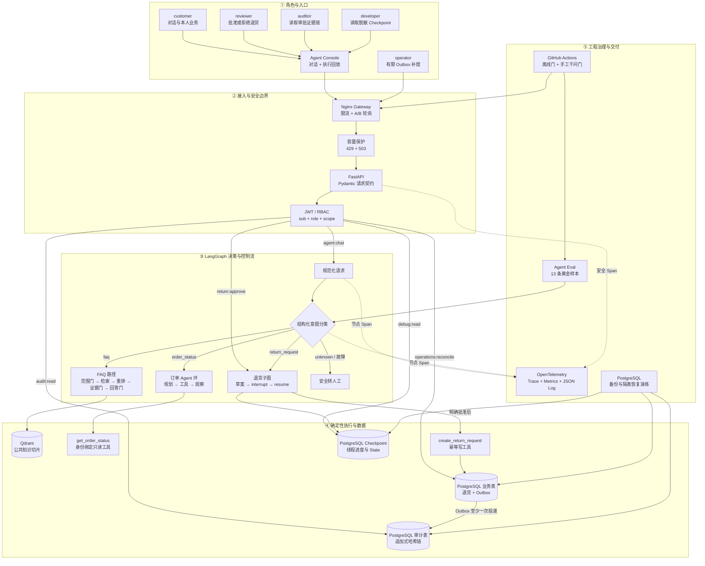
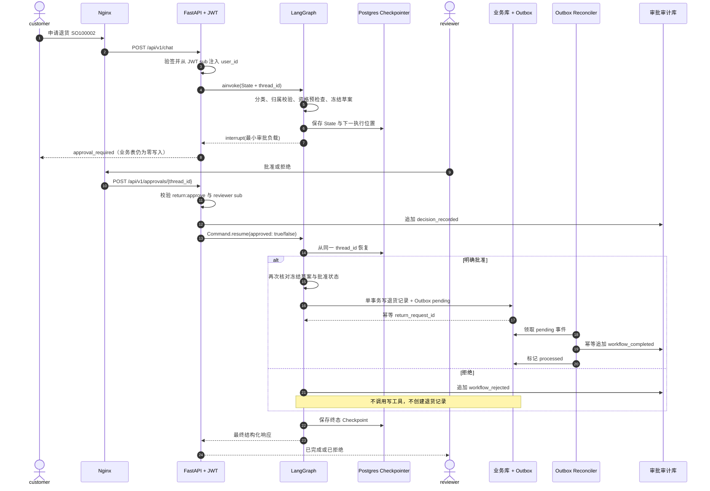
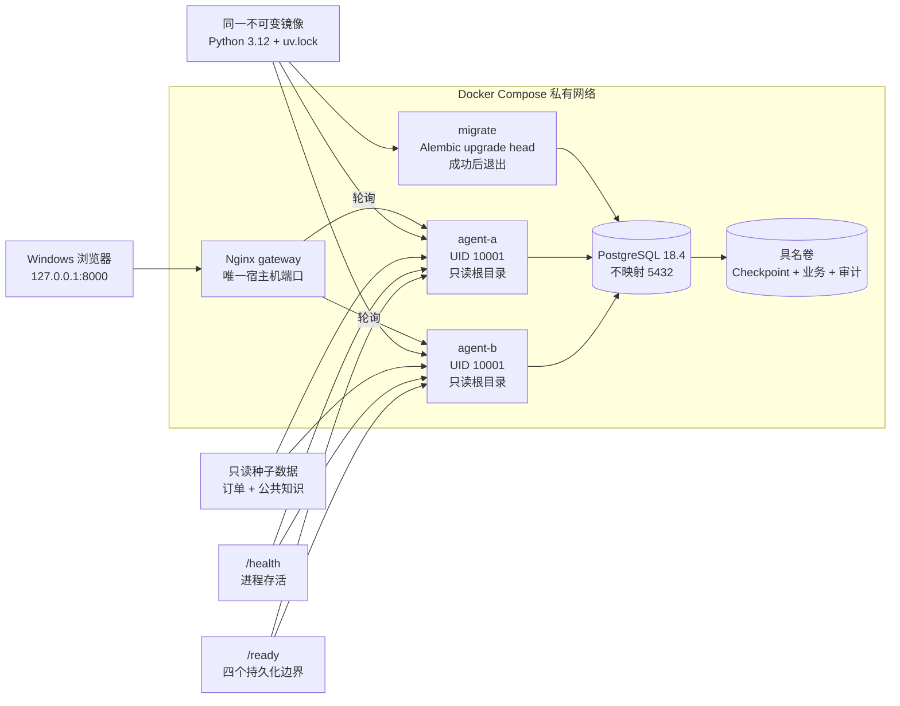

# ServiceOps Agent 架构说明

> 权威版本：Step 22 · 2026-08-21
> 阅读顺序：先看系统总览，再看高风险请求时序，最后看 Docker 部署拓扑。

这个项目不是“让大模型直接回答一切”的聊天机器人。核心设计是把不确定的模型决策、确定性的业务工具、
高风险人工审批、可恢复状态和工程治理分开，使每一层都能独立测试、替换和审计。

## 一、系统总览：五层架构

### 五层分别解决什么问题

| 层 | 白话解释 | 关键技术 | 面试证据 |
|---|---|---|---|
| 角色与入口 | 谁在使用系统 | Console、五种 JWT 角色 | 不同 Token 不能互相越权 |
| 接入与安全 | 请求能否进入业务 | Nginx、FastAPI、Pydantic、JWT/RBAC | 401/403/422、429/503 |
| Agent 控制流 | 下一步该做什么 | LangGraph State、条件边、环、interrupt | Checkpoint 播放器 |
| 执行与数据 | 现实动作和状态放哪里 | 工具白名单、Qdrant、PostgreSQL、Outbox | 工具记录、引用、业务表与审计链 |
| 工程治理 | 如何证明它可靠 | OTel、Eval、CI、备份恢复 | 165 项通过测试、13/13 评测、恢复报告 |

## 二、一次高风险请求：退货审批时序

订单查询和 FAQ 都是只读路径；退货最能体现企业 Agent 的“暂停、人工决定、恢复、幂等写入和审计”。

### 这条时序中的四道安全门

1. **身份门**：`user_id` 和 `reviewer_id` 只来自已经验证的 JWT `sub`，请求体不能覆盖。
2. **资格门**：草案阶段只读检查订单归属、状态和退货资格，不做业务写入。
3. **人工门**：只有 `return:approve` 角色的明确布尔决定才能通过 `Command.resume` 恢复。
4. **提交门**：写工具在提交瞬间重新校验，并用建议锁、唯一键、事务和幂等键防止重复创建。

## 三、Docker 部署拓扑

### 为什么两个 Agent 可以接续同一线程

`agent-a` 和 `agent-b` 自身不保存长期业务状态。它们使用同一镜像、同一图定义和同一个 PostgreSQL：
Checkpoint、退货、Outbox 和审批审计都在数据库中。因此 A 创建的 interrupt 线程可以由 B 使用相同
`thread_id` 恢复。第 17 步已经真实演练了“A 创建、停 A、B 批准恢复”。

## 四、代码目录与架构职责

| 目录 | 负责什么 | 不应该负责什么 |
|---|---|---|
| `api/` | HTTP、Schema、鉴权依赖、响应和本地控制台 | 不直接写业务规则 |
| `graph/` | State、节点、条件边、循环、interrupt | 不处理 HTTP Header |
| `domain/` | 强类型业务概念和稳定异常 | 不依赖 FastAPI 或数据库连接 |
| `tools/` | 身份绑定的确定性业务动作 | 不接受模型提供可信身份 |
| `rag/` | 切片、Embedding、检索、证据判定 | 不绕过发布状态与权限门 |
| `infrastructure/` | Checkpointer、仓储、PostgreSQL、迁移、Outbox | 不决定用户意图 |
| `security/` | JWT Claims、角色、Scope、策略 | 不生成免认证演示身份接口 |
| `observability/` | Trace、Metrics、安全日志 | 不记录 Token 或整份 State |
| `evaluation/` | 黄金集、逐层判定、模型晋级门 | 不把一次最好结果当稳定结论 |
| `demo/` | 启动和验证已有演示环境 | 不复制或绕过业务实现 |

## 五、三类数据不能混为一谈

| 数据 | 回答的问题 | 当前保存位置 | 例子 |
|---|---|---|---|
| Agent State / Checkpoint | “流程做到哪里？” | LangGraph PostgreSQL Checkpointer | 当前意图、下一节点、interrupt |
| 业务事实 | “现实中发生了什么？” | PostgreSQL 业务表 | 退货申请、Outbox 状态 |
| 审计证据 | “谁在何时做了什么决定？” | 追加式审批审计表 | decision、completed、事件哈希 |

Checkpoint 恢复成功不代表业务写入一定成功；业务记录存在也不代表审计投递一定完成。Outbox 和补偿器
就是为了解决这些边界之间可能出现的故障窗口。

## 六、当前实现与诚实边界

### 已实现并有本机证据

- LangGraph 条件路由、工具环、interrupt、`Command.resume` 和 PostgreSQL Checkpoint；
- FAQ 查询范围门、公共知识治理、Qdrant 检索、BM25候选重排、Citation、证据门和生成结果门；
- JWT/RBAC、五角色职责分离、工具身份绑定、人工审批和哈希审计链；
- PostgreSQL 业务事务、幂等、Transactional Outbox、补偿与 dead letter；
- OpenTelemetry Trace/Metrics、安全 JSON Log、liveness/readiness；
- Alembic、Nginx 双实例、限流与容量保护、备份和隔离恢复；
- 165 项通过测试、13 条 Agent 黄金样本、真实千问三轮 13/13 候选实验；
- 本地控制台、Checkpoint 教学回放和一键面试预检。

### 仍未冒充生产完成

- Compose 订单和知识仍来自本地种子；Qdrant 在演示拓扑中使用进程内存模式；
- 本地 HS256 JWT 尚未接企业 OIDC/JWKS、密钥轮换、撤销和账号目录；
- 尚未交付 TLS、云负载均衡、跨可用区数据库高可用、Kubernetes 或正式密钥管理；
- OpenTelemetry 尚未交付 Collector、Dashboard、SLO、告警和值班体系；
- Outbox 目前依靠请求后协调与运维补偿，尚未拆成独立常驻 Worker；
- PostgreSQL 已有逻辑备份恢复演练，但尚未实现异地副本、WAL 归档和 PITR；
- 尚未实现 Checkpoint 保留、归档和合规删除策略；
- 合成黄金集不能替代生产反馈、人工标注、在线评测和安全红队。

## 七、面试时的 60 秒架构表达

> ServiceOps Agent 分成五层。最外层是控制台和五种最小权限角色；请求先经过 Nginx 限流，再由
> FastAPI 完成 Pydantic 契约和 JWT/RBAC 校验。中间使用 LangGraph 管理意图路由、订单工具循环、
> RAG 证据门和退货人工中断。模型只产生结构化决策，真实行动由服务端白名单工具执行。状态进度、
> 业务事实和审计证据分别进入 PostgreSQL 的不同职责边界，业务写入通过 Outbox 可靠投递审计事件。
> 两个无状态 Agent 实例共享 PostgreSQL，因此可以跨实例恢复线程。外围再用 OTel、离线评测、CI、
> 过载保护和备份恢复证明工程可靠性；本机 Compose 用来验证机制，但不冒充完整云生产平台。

白板画法见：[面试白板架构图](architecture/interview-whiteboard.md)。
