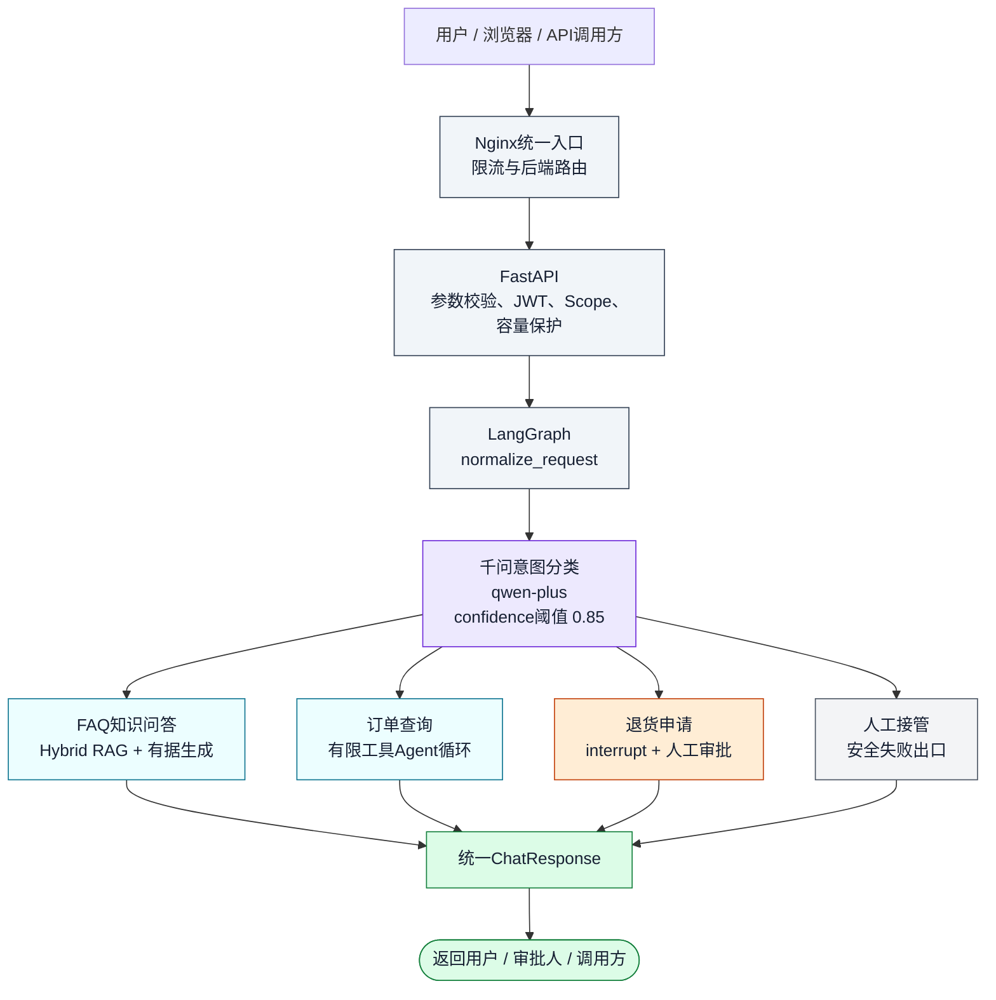
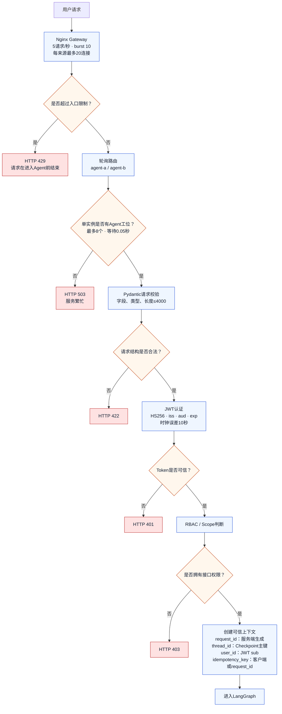
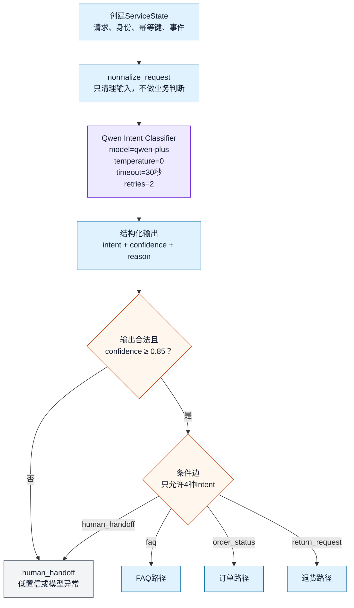
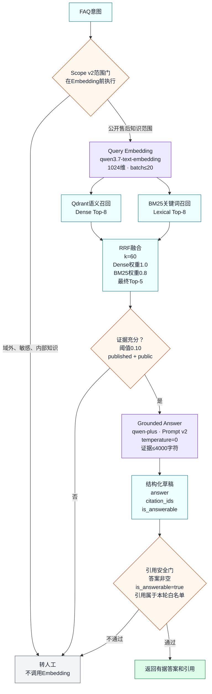
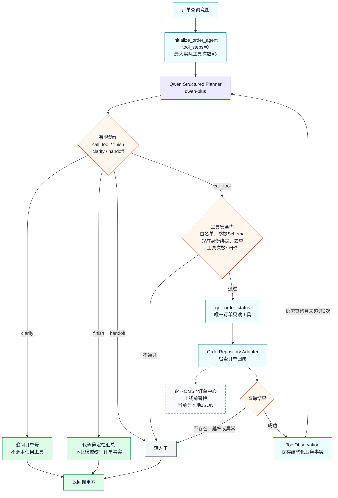
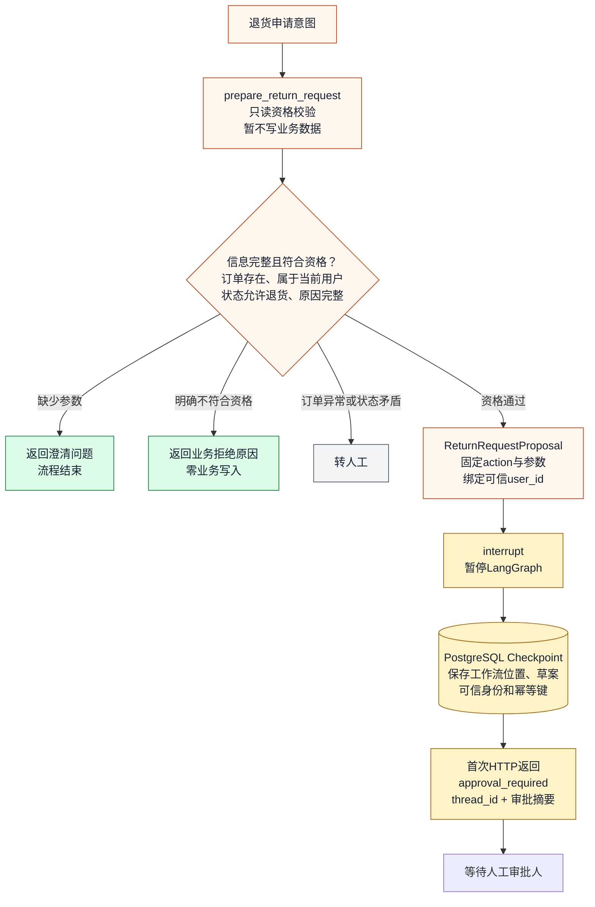
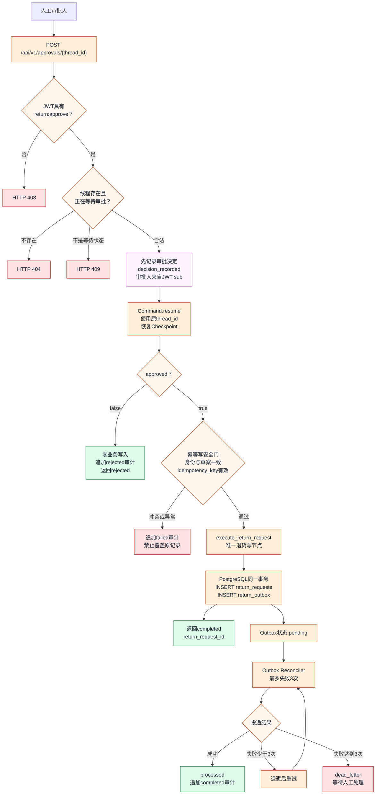
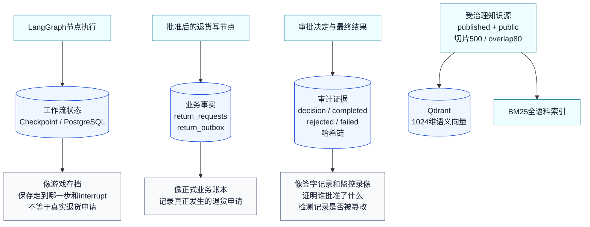
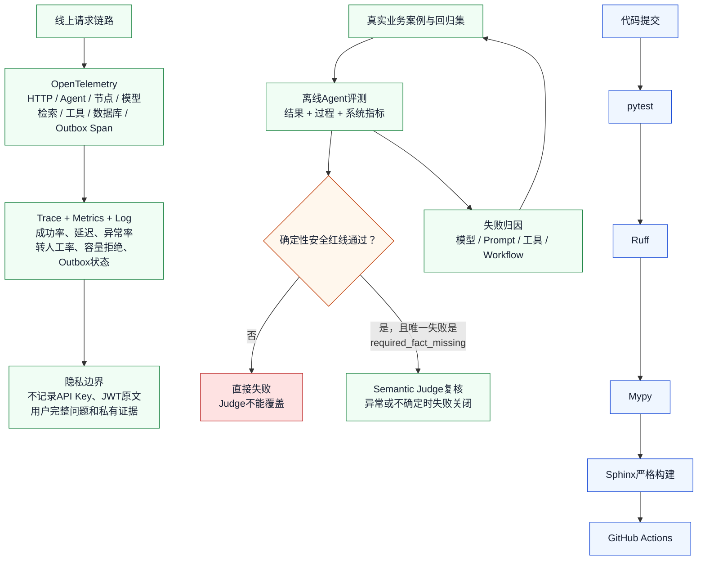

# ServiceOps Agent 端到端请求生命周期架构图

> 这是适合在 PyCharm 中阅读的分图版本。总览只展示主干，关键参数、异常、审批、数据与评测分别放在后续细图中。
>
> 在 PyCharm 中选择右上角的“编辑器和预览”。每张图都可以单独滚动查看，不需要把整套架构缩成一张小图。

## 1. 一次用户请求的全局总览

## 2. 入口、接口与安全校验

权限分工：普通客户使用 `agent:chat`；退货审批人使用 `return:approve`；运维人员使用 `operations:reconcile`；审计人员使用 `audit:read`。

## 3. LangGraph控制流与千问意图分类

## 4. FAQ：Hybrid RAG只读链路

> 当前没有独立 Cross-Encoder Reranker。这里是 Qdrant 与 BM25 双路独立召回，再由 RRF 做排名融合。

## 5. 订单查询：有限工具Agent循环

## 6. 退货上半段：资格校验、interrupt与等待审批

## 7. 退货下半段：审批恢复、幂等事务与Outbox

## 8. 工作流状态、业务事实与审计证据

## 9. 可观测、离线评测和CI治理

评测证据边界：

- 正式密封盲测：`20/30`，成功率 `66.67%`，质量门 `FAIL`，安全红线错误 `0`。
- 揭晓后人工审计：`30/30`，但不是新盲测，不能覆盖正式结果。
- 混合评测器：`30/30 REVEALED_INTEGRATION_REPLAY`，只证明评测器集成逻辑正确。

## 10. 面试讲解顺序

1. 先讲第1张总览，说明项目解决什么问题。
2. 再讲第2、3张，说明请求如何获得可信身份并进入LangGraph。
3. 用第4、5、6、7张分别解释FAQ、订单和退货为什么采用不同控制方式。
4. 用第8张解释Checkpoint、业务事实和审计证据不能混为一谈。
5. 最后用第9张解释线上可观测、离线评测和CI如何形成工程闭环。
