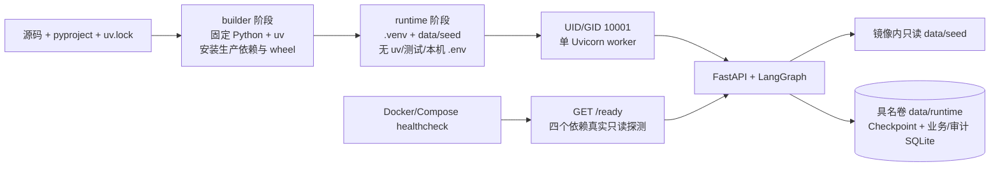

# 第十五步：可复现容器、最小权限运行与部署就绪验证

## 本步结论

本步把“只能依赖本机 PyCharm 虚拟环境运行”的应用升级为一份可构建的容器交付物：依赖由 `uv.lock`
锁定，应用以 wheel 安装语义进入最终镜像，运行进程使用固定非 root UID/GID，Compose 默认启用只读
根文件系统、最小权限、资源边界、具名 SQLite 卷和真实 readiness 健康检查。

本步没有把 Compose + SQLite 宣称为完整生产集群。它是单机部署演练和后续 Kubernetes/PostgreSQL
迁移的可靠起点：可以验证镜像、配置、持久化挂载、身份认证和健康探针，但不能支持多副本共享状态。

2026-08-20 已在当前 Windows 10 + WSL 2 + Docker Desktop 环境完成真实验收，而不再只是静态配置：

- `serviceops-agent:local` 镜像构建成功，最终大小为 `106191880` 字节（约 106 MB）；
- 容器以 `uid=10001/gid=10001` 运行，Compose 状态为 `healthy`；
- `SERVICEOPS_PROJECT_ROOT=/app`，订单种子和两份 SQLite 文件均真实存在；
- 根文件系统写入被拒绝，只有 `/app/data/runtime` 具名卷可写；
- 冒烟结果为 `liveness=ok`、四依赖 `readiness=ready`、未认证聊天接口 `401`；
- Ruff、strict Mypy 和全量 `131` 个 Pytest 用例全部通过。

GitHub Actions 镜像门仍用于在独立 Linux Runner 上复现同一契约；本机成功不能替代远程 CI 证据，
但现在可以准确陈述“镜像已在本机真实构建并启动通过”。

## 一手资料

- [Docker：Multi-stage builds](https://docs.docker.com/build/building/multi-stage/)
- [Docker：Building best practices](https://docs.docker.com/build/building/best-practices/)
- [Docker：Running containers](https://docs.docker.com/engine/containers/run/)
- [Docker Compose：Control startup order](https://docs.docker.com/compose/how-tos/startup-order/)
- [FastAPI：Docker deployment](https://fastapi.tiangolo.com/deployment/docker/)
- [uv：Using uv in Docker](https://docs.astral.sh/uv/guides/integration/docker/)
- [Docker Hub：Python Official Image](https://hub.docker.com/_/python)

FastAPI 当前文档建议通常基于官方 Python 镜像自行构建，并在容器化集群中让一个容器运行一个
Uvicorn 进程；旧的 `tiangolo/uvicorn-gunicorn-fastapi` 基础镜像已不再是推荐路径。uv 官方指南建议
锁定 uv、用 lockfile 同步，并把项目 `.venv` 排除在本机 Docker 构建上下文之外。

## 交付拓扑



构建阶段可以拥有包管理工具和下载缓存，运行阶段只保留真正需要的 Python 环境与种子数据。这样既
缩小镜像攻击面，也能用“最终镜像里不存在什么”回答企业交付问题。

## 真实容器首次启动暴露的 wheel 路径问题

集中路径模块已经支持 `SERVICEOPS_PROJECT_ROOT`，但订单仓库最初仍绕过它，直接使用：

```text
Path(__file__).resolve().parents[3]
```

源码模式下 `order_repository.py` 位于 `项目根/src/serviceops_agent/infrastructure`，因此测试一直正常；
但 wheel 安装后文件位于 `.venv/lib/python3.12/site-packages/serviceops_agent/infrastructure`，同一层级会
得到 `/app/.venv/lib/python3.12`，容器首次启动因此寻找不存在的
`/app/.venv/lib/python3.12/data/seed/orders.json`。

新策略按下面优先级发现根目录：

1. `SERVICEOPS_PROJECT_ROOT` 显式绝对路径；
2. 同时存在 `pyproject.toml` 和 `src/serviceops_agent` 时，确认源码仓库根目录；
3. wheel 本地运行没有部署配置时，退回当前启动目录。

容器固定设置 `SERVICEOPS_PROJECT_ROOT=/app`，因此 `data/seed` 和 `data/runtime` 都与 site-packages
位置解耦。订单仓库现在也统一调用 `resolve_project_path("data/seed/orders.json")`，不再拥有第二套路径
推导规则。相对的显式根目录会在启动导入阶段失败，避免同一配置因 Working directory 改变含义。

## Dockerfile 的关键设计

### 基础镜像双重固定

当前使用：

```text
python:3.12.13-slim-trixie@sha256:229a2c...d36
```

tag 说明人工可读版本，digest 锁定具体多架构清单。该摘要已直接向 Docker 官方 Registry 查询；未来
升级补丁或吸收安全更新时，应通过明确变更更新 digest、重新构建并运行门禁，不能永远冻结旧漏洞。

### 两阶段构建

`builder` 固定 `uv==0.12.5`，先复制依赖元数据并运行
`uv sync --locked --no-dev --no-install-project`，再复制源码并用 `--no-editable` 安装当前项目。
`runtime` 从干净基础镜像开始，只复制 `/app/.venv` 与 `data/seed`。

本机 `.env`、`.venv`、`data/runtime`、测试、IDE 配置和学习材料在 `.dockerignore` 中排除，不会先发送
给 Docker daemon 再期待后续不被 `COPY`。

### 非 root 与单进程

最终镜像创建固定 `10001:10001` 并执行：

```text
USER 10001:10001
CMD ... uvicorn ... --workers 1
```

固定数字 ID 便于 Compose/Kubernetes 与存储权限一致。一个容器只运行一个 Uvicorn worker，是因为
当前 Checkpointer 和业务仓库使用本地 SQLite；在同一容器盲目加多 worker 并不能得到可靠多副本架构。
生产扩缩容应先迁移到 PostgreSQL/AsyncPostgresSaver，再由平台增加副本。

## Compose 的安全边界

本地 `compose.yaml` 默认实施：

- 端口只绑定 `127.0.0.1:8000`，不向局域网暴露开发 JWT；
- 镜像内应用和种子数据只读，只有 `/app/data/runtime` 具名卷可写；
- `/tmp` 使用 `noexec,nosuid` 的 64 MiB tmpfs；
- 删除全部 Linux Capability，启用 `no-new-privileges`；
- 固定非 root 用户，并限制 PID、内存和 CPU；
- 使用 mock/deterministic/hash/extractive，绝不自动读取本机千问 Key；
- `/ready` 必须真实读通 Checkpointer、退货仓库、Outbox 和审计仓库才健康。

Compose 中 `SERVICEOPS_ENVIRONMENT=development` 是刻意的：仓库开发 JWT 默认值只能用于回环地址演示。
若改成 `production`，Settings 会拒绝默认 JWT Secret 和 Console 遥测。真正部署必须通过 Secret Manager
或平台 Secret 注入独立密钥，不能把 `.env` 烘焙进镜像。

## 安装 Docker 后的运行方式

在 PowerShell 进入项目根目录：

```powershell
cd D:\serviceops-agent
docker compose config
docker compose build
docker compose up --detach --wait --wait-timeout 60
docker compose ps
uv run python examples/15_container_smoke_test.py
```

当前电脑通过本机代理访问外部镜像仓库。如果普通 `docker compose build` 能下载依赖，不需要增加任何
参数；若只有 BuildKit 中的 pip/uv 下载超时，可显式把 Docker Desktop 内部代理只传给构建阶段：

```powershell
docker compose build `
  --build-arg HTTP_PROXY=http://http.docker.internal:3128 `
  --build-arg HTTPS_PROXY=http://http.docker.internal:3128 `
  --build-arg NO_PROXY=localhost,127.0.0.1
```

这些预定义代理参数不会写入最终镜像配置。代理地址属于当前开发机环境，不能硬编码进 `Dockerfile`
或提交真实代理凭据。

期望冒烟输出：

```text
PASS: liveness=ok, readiness=ready(4/4), unauthenticated_chat=401
```

浏览器仍可打开 `http://127.0.0.1:8000/docs`。查看有限日志或停止服务：

```powershell
docker compose logs --tail 100 gateway agent-a agent-b migrate postgres
docker compose down
```

`docker compose down` 不会删除具名卷，SQLite 数据可在下次启动恢复。只有你明确不再需要本地数据时才
使用 `docker compose down --volumes`；这个命令会删除 Checkpoint、退货记录和审计数据，不能随手执行。

## PyCharm 中怎么查看

社区版可以直接在 Terminal 执行上面的 Compose 命令，再运行 `examples/15_container_smoke_test.py`。
PyCharm Professional 安装并启动 Docker Desktop 后，可在：

```text
Settings → Build, Execution, Deployment → Docker
```

连接 Docker Desktop，然后右键 `compose.yaml` 运行。Services 窗口可以查看容器状态和日志；Python
源码编辑、测试仍使用现有 `D:\serviceops-agent\.venv\Scripts\python.exe`，不需要把日常解释器改成
容器解释器。

## 自动镜像门做什么

`.github/workflows/container-image.yml` 在 Push/Pull Request 中：

1. 使用只读 `GITHUB_TOKEN` 检出代码；
2. 执行真实 `docker build --pull`；
3. 检查最终镜像默认用户为 `10001:10001`；
4. 以只读根文件系统、无 Capability、具名卷启动容器；
5. 最多等待 60 秒，验证 `/ready` 的四个依赖全部 ready；
6. 验证不带 JWT 的 `/api/v1/chat` 返回 401；
7. 无论成功失败都输出日志并清理临时容器与 CI 卷。

该工作流不使用模型 Secret，也不调用千问。它和 Python 离线门职责不同：Python 门验证代码行为，镜像门
验证构建上下文、Linux 安装布局、容器权限和启动契约。

## 面试官可能追问

### 为什么不用旧的 FastAPI/Gunicorn 一体基础镜像？

当前 FastAPI 官方更推荐基于官方 Python 自行构建；在容器编排环境中，一个容器运行一个 Uvicorn 进程，
副本由平台管理。这样镜像来源、依赖、进程和扩缩容边界更清晰。

### 为什么 healthcheck 使用 `/ready` 而不是 `/health`？

`/health` 只证明进程活着；数据库不可读时继续接流量会制造错误。`/ready` 真实探测四个持久化边界，
失败会返回 503，让平台停止分流，但不必立即把仍可诊断的进程杀掉。

### 为什么镜像中不复制 `.env`？

镜像会被缓存、分发和扫描，烘焙密钥会扩大泄漏面且难以轮换。镜像只包含非敏感运行物，Secret 应在
运行时由平台注入，日志和镜像历史都不能出现 Key。

### 既然有 Compose，为什么还不是生产可用？

当前状态、业务和审计边界仍是单机 SQLite，没有外部 OIDC、远程 PostgreSQL、入口 TLS/限流、备份恢复、
多副本验证和 Collector/SLO。Compose 证明“交付单元可运行”，不能替代生产基础设施和容量证据。

### digest 固定后如何获得安全更新？

固定不是永不更新，而是让更新从不可见漂移变为可评审变更。定期扫描基础镜像，更新 tag/digest，经过
镜像构建、单元测试、Agent Eval 和冒烟门后再发布。

## 本步代码位置

- `Dockerfile`：固定版本/摘要的多阶段非 root 镜像；
- `.dockerignore`：密钥、本机环境和运行状态的构建上下文边界；
- `compose.yaml`：本机单节点安全部署演练；
- `src/serviceops_agent/config/paths.py`：源码/wheel/容器三种布局的根目录发现；
- `src/serviceops_agent/infrastructure/order_repository.py`：订单种子也统一使用部署根目录解析；
- `examples/15_container_smoke_test.py`：liveness、readiness、401 部署冒烟；
- `.github/workflows/container-image.yml`：真实 Linux 镜像构建与启动门；
- `tests/unit/test_project_paths.py`：路径优先级和 wheel 回退测试；
- `tests/unit/test_container_contract.py`：容器最小安全契约与连接中断收敛测试。

## 本步质量门

- 显式根目录必须是绝对路径且优先级最高；
- 源码目录必须通过双标记识别，wheel 安装不能误把 `.venv` 当根目录；
- Dockerfile 必须多阶段、锁定基础镜像/依赖、非 editable、非 root、单 worker；
- 构建上下文必须排除 `.env`、`.venv` 和 `data/runtime`；
- Compose 必须回环绑定、只读根目录、零 Capability、无提权和离线后端；
- 镜像 CI 必须真实等待四依赖 readiness 并验证未认证 401；
- Ruff、strict Mypy、全量 Pytest 和离线 Agent Eval 必须继续通过。
- 当前本机实测为 Ruff 通过、strict Mypy 通过、`131 passed`，容器冒烟通过。
